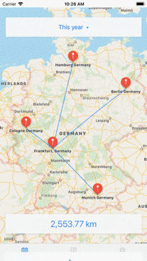
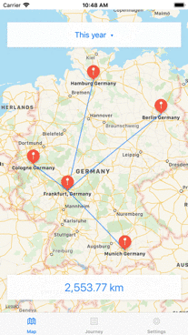

# Myleholic (iOS)

An iOS-App that let you know how far you've been on the move.

### Features:
* Any location can be easily found
* Routes are calculated based on previous travellings
* Geographical distances are summed up cumulatively
* Routes and places can be clearly seen on the map

## Dependencies
* [RealmSwift](https://realm.io/docs/swift/latest/) – an alternative database to SQLite and Core Data
* [Eureka](https://eurekacommunity.github.io/) – elegant iOS form builder in Swift
* [SwiftIconFont](https://github.com/0x73/SwiftIconFont) – vector icon fonts for iOS

## Requirements
* iOS 11.0+
* XCode 9+
* Swift 4

## Examples

<table>
  <tr>
    <th>
      
    </th>
    <th>
      
    </th>
  </tr>
</table>
